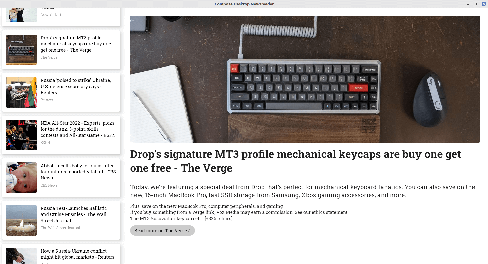
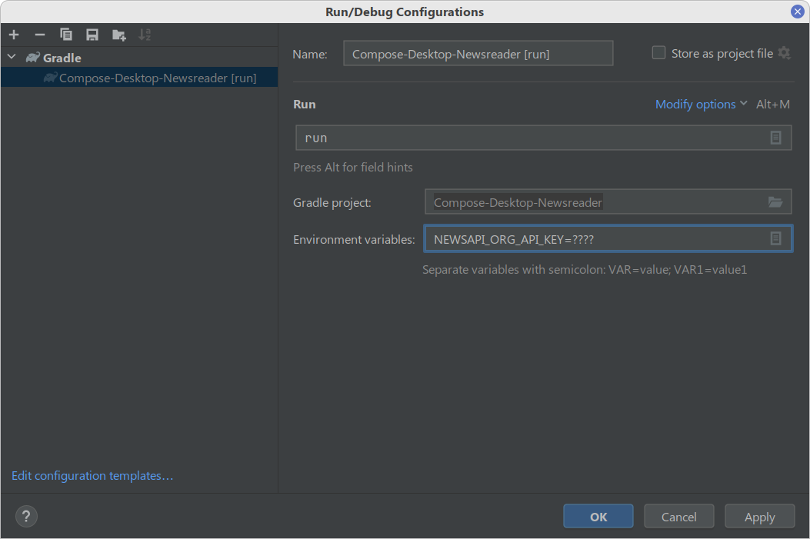

# Compose Desktop Newsreader
A simple newsreader app using Compose Desktop.

The app fetches the latest news from newsapi.org and shows a list of articles.

**Status: in development**



## NewsApi.org account and API key
The application uses free APIs from NewsApi.org. These APIs require an API key. 

The project looks for the environment variable `NEWSAPI_ORG_API_KEY` when compiling.

Here's how to obtain one and set up the project:

 1. Go to [newsapi.org](https://newsapi.org/) to create an account and get an API key.
 2. Use this API key to create an environment variable `NEWSAPI_ORG_API_KEY` in your platform. 

If you are running directly from IntelliJ IDEA, this is easy to do by going to **Run | Edit Configurations...** and adding the environment variable under the selected configuration (See the "Compile & Run" section below).
 
## Compile & Run

If you have the environment variable setup, just do:

```shell
$ ./gradlew run
```

From IntelliJ Idea, go to **Run | Edit Configurations...**, and add a new "Gradle" configuration. Under **Run** choose "run". Add the environment variable `NEWSAPI_ORG_API_KEY` in the **Environment variable** section.



## License
The project uses MIT License. Please check the [LICENSE.txt](LICENSE.txt) for more details.